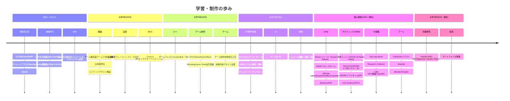
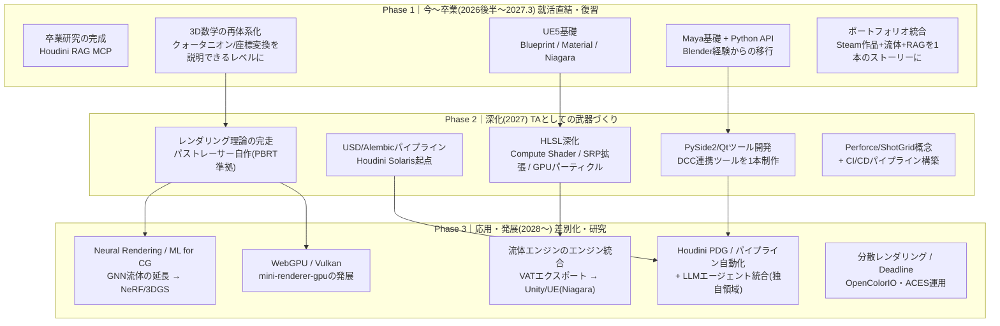
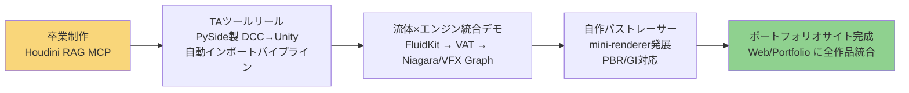

## HelloWorld

# 主要制作物
## 補助ツール
## [Research-Collector](https://manato1201.github.io/Research-Collector/)
## [CADGPUInferenceModeling](https://manato1201.github.io/CADGPUInferenceModeling/)

## ゲーム作品
## [JunkShooting](https://github.com/manato1201/JunkShooting)
## [AdvancedVAT](https://github.com/manato1201/AdvancedVAT)
## [piece-peace](https://github.com/manato1201/piece-peace)

<!--
**manato1201/manato1201** is a ✨ _special_ ✨ repository because its `README.md` (this file) appears on your GitHub profile.

Here are some ideas to get you started:

- 🔭 I’m currently working on ...

- 👯 I’m looking to collaborate on ...
- 🤔 I’m looking for help with ...
- 💬 Ask me about ...
- 📫 How to reach me: ...
- 😄 Pronouns: ...
- ⚡ Fun fact: ...
-->  

  
    

## Stats

- ## Skill

- ## Tool
 

- ## Learning
 

# 学習・制作ロードマップ

> 作成日: 2026-07-03
> 参照: [STUで求められるスキルセット 学習ロードマップ (2021年10月改定)](https://www.stu-inc.com/uploads/stu_roadmap_5374985edc.png)
> 調査対象: `D:\大学` / `D:\個人\高校実習` / `C:\Users\matuu\Desktop\GameDevelopment`

---

## 1. 現在地

- **東京国際工科専門職大学 4年**(2026年7月)— 卒業研究(Houdini Help RAG MCP)・就活期
- 目指す方向性: **テクニカルアーティスト / CGエンジニア / グラフィックスプログラマー**(STUロードマップ準拠)
- 既に **Steam でゲームをリリース済み**(Qualial Nature)。個人開発の深度は学生水準を大きく超えている

---

## 2. これまでの歩み(実績タイムライン)

---

## 3. スキル棚卸し × STUロードマップ ギャップ分析

STUロードマップの必須(❤)・推奨(✅)項目に対する現状。

### ✅ 習得済み(実績あり)

| カテゴリ | スキル | 根拠となる実績 |
|---|---|---|
| 言語 | C# | 高校WPF〜Unity/UdonSharp まで5年以上 |
| 言語 | C++ | ゲームアルゴリズム、Siv3D、WASM SPH(外部依存ゼロ実装) |
| 言語 | Python | 流体ソルバー(numpy完全ベクトル化)、RAG、uv運用 |
| 言語 | HTML/JS | 高校Web課題〜Three.jsビューア、ポートフォリオ |
| CG数学 | 三角関数・行列・クォータニオン | Siv3D課題(IK・スキニング・OBB)で実践済み |
| CG | 衝突判定・剛体・補間 | OBB/カプセル/RigidRect/Interpolation |
| ゲームエンジン | Unity(Built-in/URP/HDRP) | Steamリリース、HDRP、VAT、VRChat SDK |
| DCC | Blender / Houdini / C4D | fluid HDA、Blender MCP連携、C4D課題 |
| バージョン管理 | Git / GitHub | 全個人リポジトリ、GitHub Actions(FluidKit) |
| サーバー/仮想化 | WSL2 / Docker | 卒研(pgvector on Docker) |
| データ | JSON / SQLite / PostgreSQL | 中間フォーマット運用、卒研DB |
| ネットワーク | TCP/IP・HTTP | 高校チャットアプリ(ソケット)、APIサーバー |
| **STU範囲外の強み** | LLM/RAG/MCP・GNN・音声認識 | mcp-rag-server、Neural Fluid、Vosk — **AI×TAの差別化要素** |

### ⚠️ 復習・体系化が必要(触ってはいる)

| スキル | 現状 | やること |
|---|---|---|
| レンダリング理論 | mini-rendererで着手済みだが体系化不足 | スキャンライン→レイトレ→パストレ→GIの理論を一気通貫で整理 |
| シェーダー(HLSL) | Unityシェーダー経験あり | Compute Shader・SRP拡張まで踏み込む |
| Unreal Engine | UnrealGameフォルダあり(浅い) | STU必須の Blueprint / Material / Niagara / コンテンツパイプライン |
| 3D数学 | 授業で習得済み | クォータニオン・座標変換を「人に説明できる」レベルに再整理(就活対策) |
| CI/CD・テスト | GitHub Actions一部使用 | pytest習慣化、ビルド自動化パイプライン |
| ドキュメンテーション | README/講義資料は書ける | Doxygen/Sphinxなど生成系ツール |

### ❌ 未着手(STU必須・推奨とのギャップ)

| スキル | STU上の扱い | 優先度 |
|---|---|---|
| **Autodesk Maya + MEL/PyMEL/Python API** | 必須 | **高** — TA職の共通言語。Blender/Houdini経験があるので移行は速い |
| **Perforce** | 必須 | 中 — 概念だけ先行学習(ワークスペース/ストリーム)。実務で習得可 |
| USD / Alembic / FBX SDK | Scene Description | **高** — パイプラインTAの中核。Houdini Solarisから入ると効率的 |
| ShotGrid(+API) | 必須 | 低 — 入社後でよい。概念(工程管理)だけ把握 |
| Qt / PySide2 | 推奨 | **高** — DCCツール開発の標準。Python力があるので即戦力化しやすい |
| OpenColorIO / ACES | カラーマネジメント | 中 — HDRP経験と接続すると理解が速い |
| 文字エンコーディング | 必須 | 低 — Shift-JIS/UTF-8の実務知識を1日で整理 |
| Vulkan / DirectX 12(生API) | Graphics API | 中 — mini-renderer-gpuの発展として |

---

## 4. 今後の学習ロードマップ

### Phase 1 の優先順位(理由つき)

1. **卒業研究** — 卒業要件。RAG×Houdiniは他の学生がやっていない領域なのでそのまま就活の主砲になる
2. **3D数学の復習** — TA/グラフィックス職の面接頻出。実装経験(Siv3D課題)があるので「言語化」だけが課題
3. **UE5(Blueprint/Material/Niagara)** — STU必須で唯一の大きな空白。Unity経験があるので概念マッピングで速習可能
4. **Maya + Python API** — TA求人の必須要件筆頭。「Blenderはできます」だけだと選考で不利になりがち
5. **ポートフォリオ** — Steamリリース・流体R&D・RAG基盤を「技術で制作を支えるTA」の物語に編集する

---

## 5. 制作ロードマップ(ポートフォリオ強化)

| 制作物 | 使う既存資産 | 証明できるスキル |
|---|---|---|
| TAツール(PySide) | mcp-rag-server のPython力 | ツール開発・パイプライン設計 |
| 流体×Niagara統合 | FluidKit + AdvancedVAT | シミュレーション・VFX・エンジン間データ変換 |
| 自作パストレーサー | mini-renderer / mini-renderer-gpu | レンダリング理論・C++/GPU |
| LLM支援制作環境 | Houdini RAG MCP(卒研) | **独自領域: AI活用パイプライン** |

---

## 6. 学習方針(STUロードマップ備考より)

- 項目名の暗記ではなく、**各項目を自分で掘り下げて初めて知識になる** — 幸いあなたは「作って学ぶ」型が既に確立している
- 一見無関係な技術も間接的に業務で使われる — **RAG/LLM経験は現時点のSTUマップに無い将来価値**
- トレンドは変わる。技術者である限り一生勉強 — 現在のペース(授業+個人R&D並走)を維持すれば十分戦える

### 週次の目安

| 枠 | 内容 |
|---|---|
| 最優先 | 卒業研究 + 就活(ポートフォリオ) |
| 週2〜3h | Phase 1 の空白埋め(UE5 → Maya の順) |
| 隙間時間 | 3D数学の言語化(ノート化・ブログ化すると面接対策と一石二鳥) |

