## HelloWorld

# 主要制作物
## 卒業研究
## [RAGを用いた動的チュートリアル生成](https://github.com/manato1201/DevelopmentRAGEnvironment)

## 補助ツール
## [Research-Collector](https://manato1201.github.io/Research-Collector/)
## [CADGPUInferenceModeling](https://manato1201.github.io/CADGPUInferenceModeling/)

## 学習成果物
## [LearningFluidEngine](https://github.com/manato1201/LearningFluidEngine)
## [LearningQuickDraw](https://github.com/manato1201/LearningQuickDraw)

## ゲーム作品
## [JunkShooting](https://github.com/manato1201/JunkShooting)
## [AdvancedVAT](https://github.com/manato1201/AdvancedVAT)
## [piece-peace](https://github.com/manato1201/piece-peace)

<!--
**manato1201/manato1201** is a ✨ _special_ ✨ repository because its `README.md` (this file) appears on your GitHub profile.

Here are some ideas to get you started:

- 🔭 I’m currently working on ...

- 👯 I’m looking to collaborate on ...
- 🤔 I’m looking for help with ...
- 💬 Ask me about ...
- 📫 How to reach me: ...
- 😄 Pronouns: ...
- ⚡ Fun fact: ...
-->  

  
    

## Stats

- ## Skill

- ## Tool
 

- ## Learning
 

# 松浦真聖 学習・制作ロードマップ

> 作成日: 2026-07-03(最終更新)
> 構成は [STUスキルセット学習ロードマップ](https://www.stu-inc.com/uploads/stu_roadmap_5374985edc.png) のスタイル(カテゴリ別スキルツリー+バッジ)を踏襲。
> **中身は自分の実績(`D:\個人\高校実習` → `D:\大学` → `GameDevelopment`)のみから構成。**

## バッジの説明(全図共通の凡例)

| バッジ | 色 | 意味 |
|---|---|---|
| 🟢 | 濃緑背景 + 白文字 | **習得済み** — 実績・成果物あり |
| 🟡 | 濃橙背景 + 黒文字 | **復習すべき** — 経験はあるが体系化・言語化が必要 |
| 🔵 | 濃青背景 + 白文字 | **今後学ぶ** — 自分の路線の延長で必要になる |
| 🟣 | 濃紫背景 + 白文字 | **応用・発展** — 既存スキルを掛け合わせて到達できる領域 |
| ⬛ | スレート背景 + 白文字 | カテゴリ見出し(分類ノード、バッジなし) |

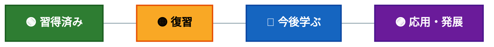

---

## 全体マップ(STUの「緑の道」に相当)

> 🕐 **時期:** 高校(2020-2023) → 大学1〜4年(2023-2026・現在)の全体像

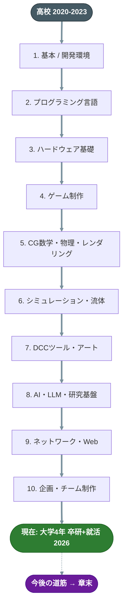

---

## 1. 基本 / 開発環境

> 🕐 **時期:** 高校(2020-2023)で基礎ツール操作を習得 → 大学〜現在まで継続的に更新
> 🎨 **凡例:** 🟢習得済み ｜ 🟡復習 ｜ 🔵今後学ぶ ｜ 🟣応用発展(詳細は冒頭バッジ表を参照)

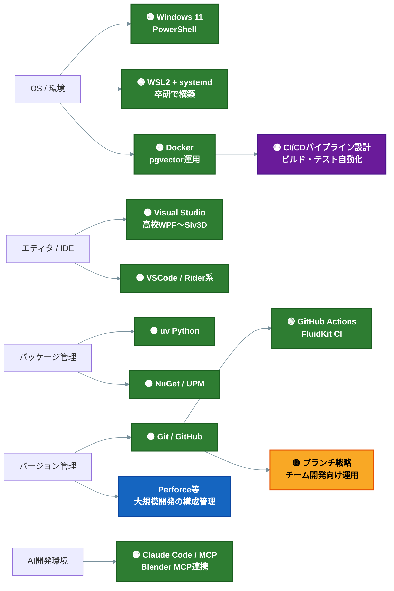

---

## 2. プログラミング言語

> 🕐 **時期:** 高校C#(2020-2023) → 大学1〜4年でC/C++/Python/JS/シェーダーへ拡大(2023-2026)
> 🎨 **凡例:** 🟢習得済み ｜ 🟡復習 ｜ 🔵今後学ぶ ｜ 🟣応用発展

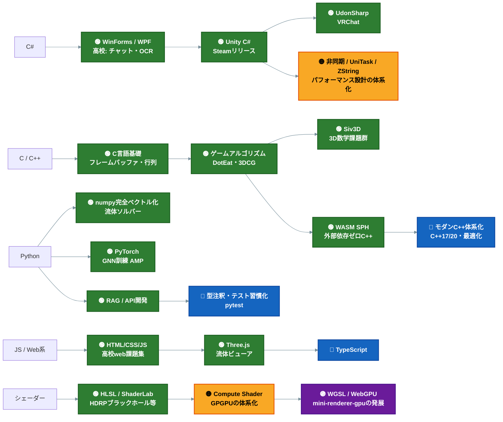

---

## 3. ハードウェア基礎

> 🕐 **時期:** 高校 工業実習・情報技術実習(2021-2023) → 大学1年 電子情報工学概論(2023) → 大学3年 ゲームハード概論(2025)
> 🎨 **凡例:** 🟢習得済み ｜ 🟡復習 ｜ 🔵今後学ぶ ｜ 🟣応用発展

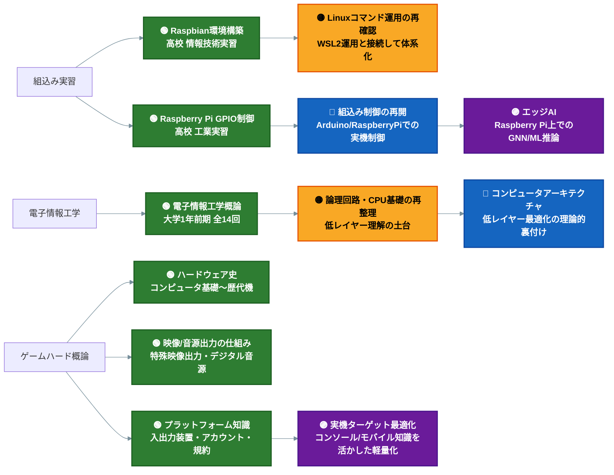

---

## 4. ゲーム制作

> 🕐 **時期:** 大学1〜4年の授業(2023-2026)、個人開発・Steamリリースは2024年〜並行
> 🎨 **凡例:** 🟢習得済み ｜ 🟡復習 ｜ 🔵今後学ぶ ｜ 🟣応用発展

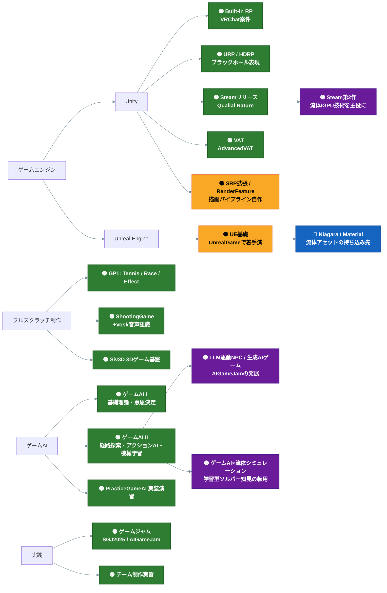

---

## 5. CG数学・物理・レンダリング

> 🕐 **時期:** 大学1年 基礎数学(2023) → 大学3年 ゲームプログラミング2で集中的に実装(2025)
> 🎨 **凡例:** 🟢習得済み ｜ 🟡復習 ｜ 🔵今後学ぶ ｜ 🟣応用発展

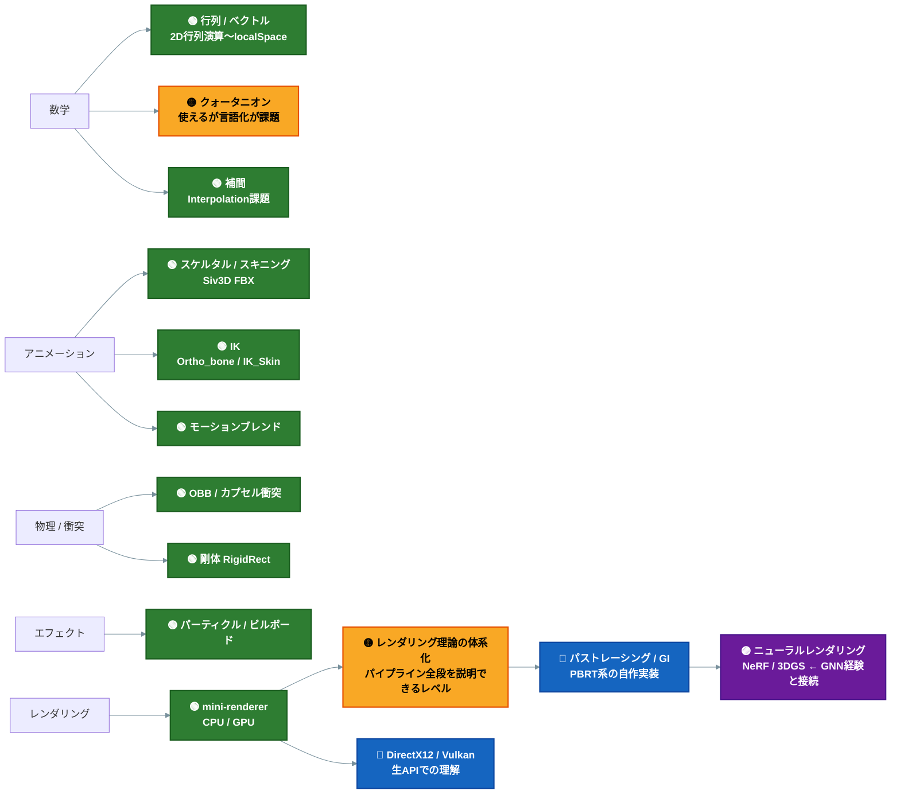

---

## 6. シミュレーション・流体(最大の独自領域)

> 🕐 **時期:** 個人R&D 2024年〜現在(大学の授業外で継続開発)
> 🎨 **凡例:** 🟢習得済み ｜ 🟡復習 ｜ 🔵今後学ぶ ｜ 🟣応用発展

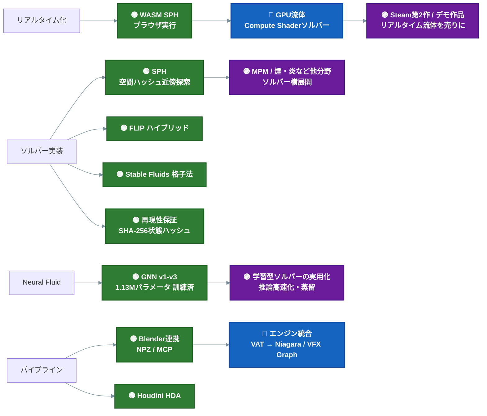

---

## 7. DCCツール・アート

> 🕐 **時期:** 高校 デジタル造形(C4D, 2023) → 個人制作で継続中(2023〜現在)
> 🎨 **凡例:** 🟢習得済み ｜ 🟡復習 ｜ 🔵今後学ぶ ｜ 🟣応用発展

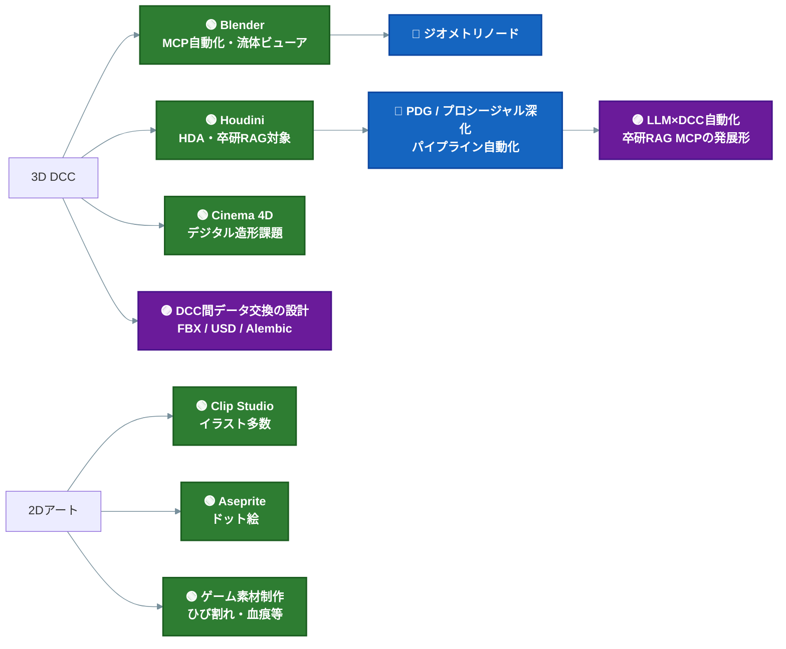

---

## 8. AI・LLM・研究基盤

> 🕐 **時期:** 個人R&D 2024年〜、大学4年 卒業研究として集大成(2025-2026)
> 🎨 **凡例:** 🟢習得済み ｜ 🟡復習 ｜ 🔵今後学ぶ ｜ 🟣応用発展

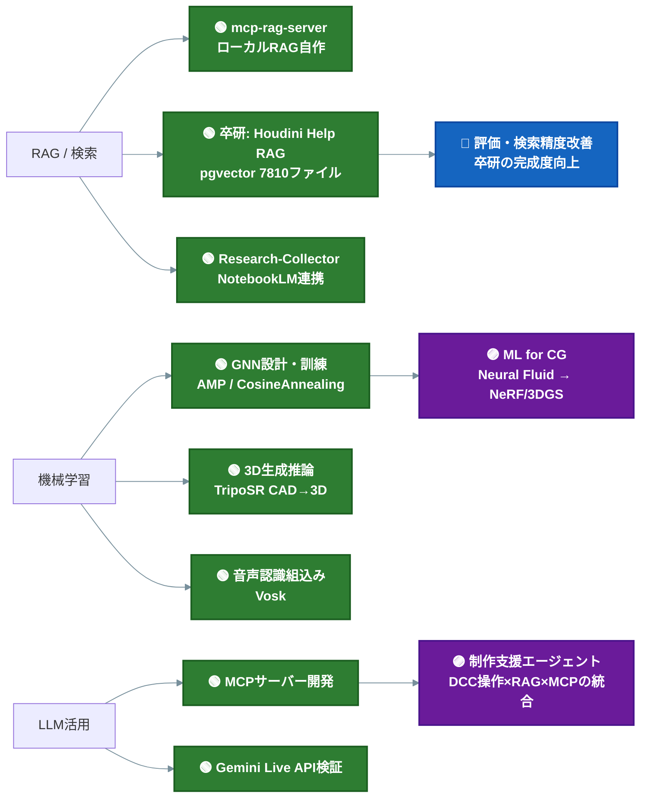

---

## 9. ネットワーク・Web

> 🕐 **時期:** 高校 チャットアプリ実習(2022-2023) → 個人API開発で継続(2024〜)
> 🎨 **凡例:** 🟢習得済み ｜ 🟡復習 ｜ 🔵今後学ぶ ｜ 🟣応用発展

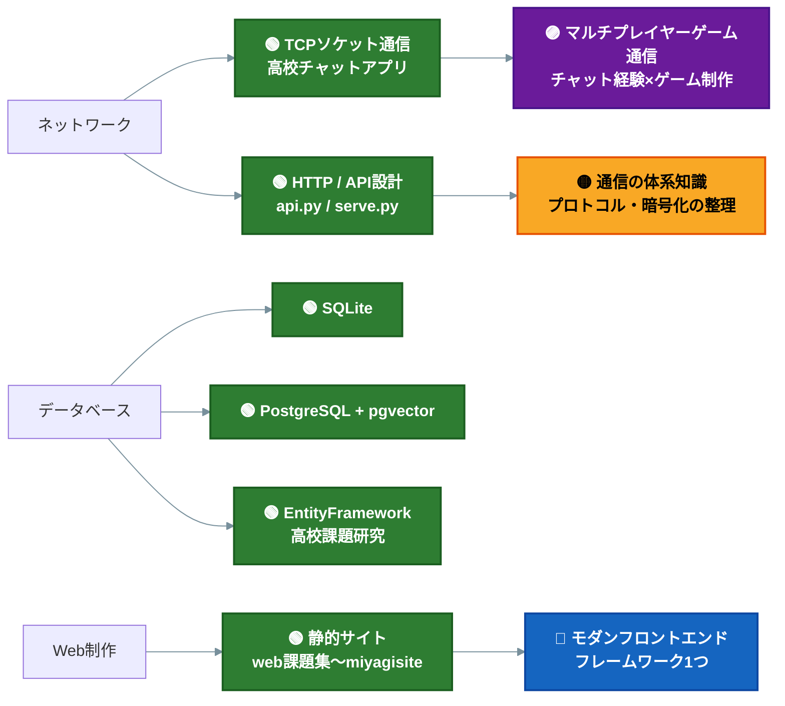

---

## 10. 企画・チーム制作

> 🕐 **時期:** 大学1〜3年の授業・実習(2023-2025)
> 🎨 **凡例:** 🟢習得済み ｜ 🟡復習 ｜ 🔵今後学ぶ ｜ 🟣応用発展

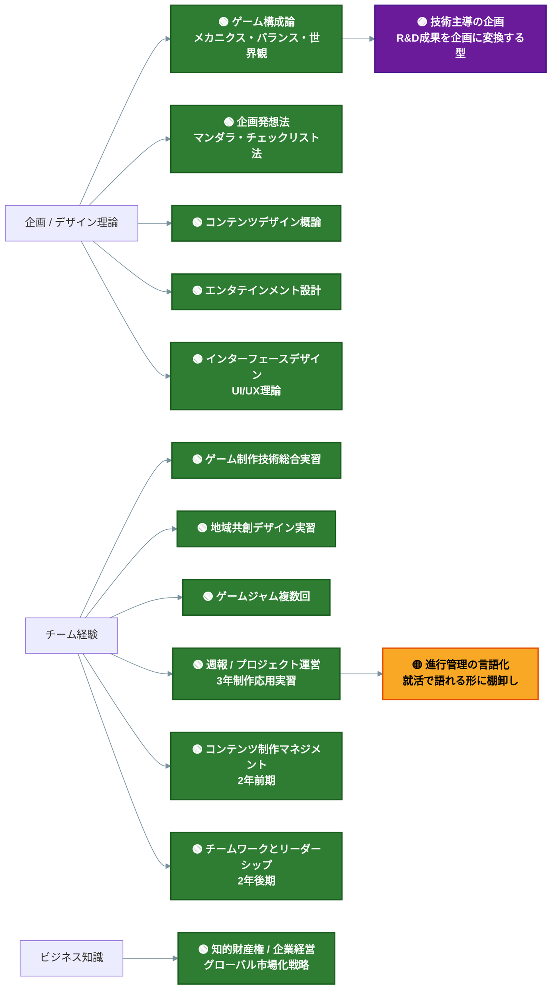

---

## 今後の道筋(復習 → 学習 → 応用・発展)

> 🕐 **時期:** 2026年後半(卒業まで) → 2027年(深化) → 2028年〜(応用)を想定
> 🎨 **凡例:** 🟡復習(まず言語化) ｜ 🔵今後学ぶ(既存資産の延長) ｜ 🟣応用発展(掛け合わせ)
> 自分の実績の延長線だけで組んだ優先順位。

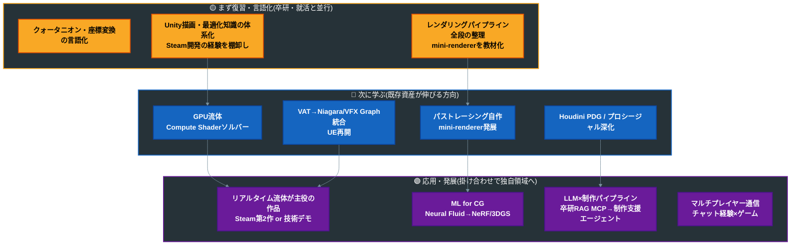

### 制作ロードマップ(成果物ベース)

> 🕐 **時期:** 済(2024〜) → 2026年内(卒業) → 2027年(深化) → 2028年〜(応用作品)
> 🎨 **凡例:** 🟢習得済み(完了) ｜ 🟡復習中の成果物 ｜ 🔵次の制作 ｜ 🟣到達点

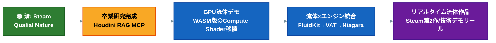

---

## まとめ

- **一貫した軸**: 「動くものを作りながら低レイヤーへ潜る」— 高校: 組込み(Raspberry Pi)/アプリ(C#) → 大学: ゲームフルスクラッチ → 3D数学・ハードウェア理論 → 自作ソルバー/レンダラー → ML
- **他人と被らない資産**: ①自作流体エンジン一式(SPH/FLIP/GNN/WASM) ②LLM/RAG/MCP基盤 ③Steamリリース実績 ④高校由来の組込み/ハードウェア知識(電子情報工学概論・ゲームハード概論と地続き)。今後はこれらの**掛け合わせ**(リアルタイム流体作品、ML for CG、エッジAI、制作支援エージェント)が最も費用対効果が高い
- **弱点は「新技術」ではなく「言語化」**: 実装済みのものを説明できる形に整理することが、就活期の最優先タスク

